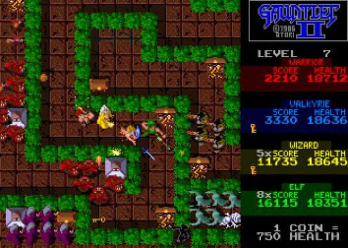
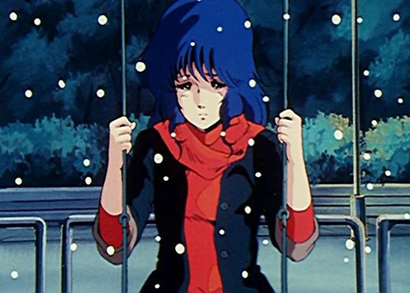
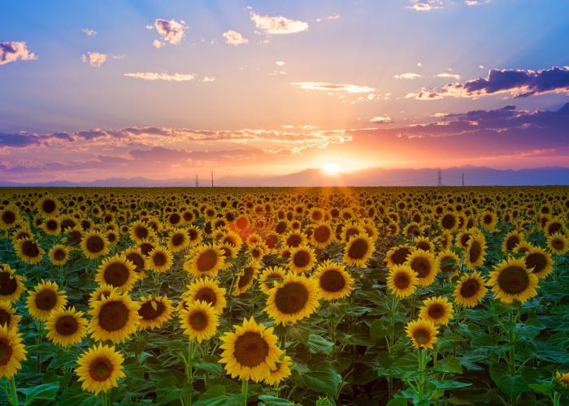
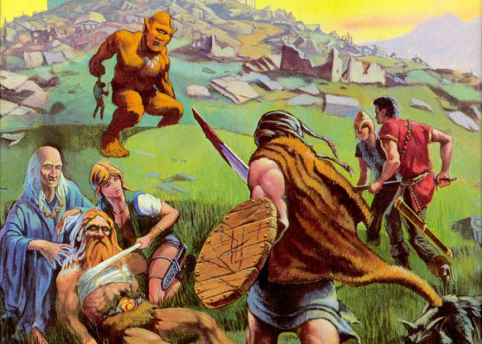
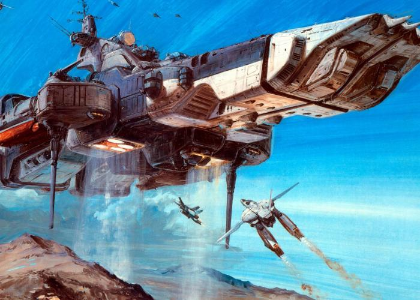

# ShellView

Summary   | Current Release
----------|-----------------------
Version   | 2.1
Date      | November 9, 2022
Platforms | macOS, Linux (Ubuntu+), Windows
Author    | Abe Pralle

# About
ShellView is a console-based image viewer with pan and zoom. It uses character block graphics and ANSI colors to display JPEGs, PNGs, and BMPs. macOS and Linux utilize 256 color mode; Windows uses 16 color mode.

# Demo

# Reference Images
Gauntlet II | Minmei                                       | Sunflowers
------------|----------------------------------------------|------------
 |  | 
By Atari | Robotech/Macross |

Towards New Adventures! | Wizard's Crown | SDF-1
------------------------|----------------|------
 |   |  |
By [Worrior1](https://twitter.com/PETSCIIWORLD/status/1388846460544987139?s=20) | By SSI | Robotech/Macross

# Installation

## New Installation

1. Install [morlock.sh](https://morlock.sh)
2. `morlock install abepralle/shellview`

## Updating Existing Installation
`morlock update shellview`

# Usage
    USAGE
      shellview [OPTIONS] [image-filepaths...]

    COMMANDS (INTERACTIVE MODE)
      I, O, LEFT/RIGHT CLICK, SCROLL WHEEL
        Zoom in or out.

      WASD, HJKL, ARROW KEYS, MOUSE DRAG
        Scroll around image if zoomed in.
        Cycle next/previous image if zoomed out (A/D, H/L, LEFT/RIGHT).

      N, B or C, Z
        Cycle to (N)ext image or (B)ack to previous image.
        Alternately, (C)ontinue to next or (Z)=back.

      G
        Toggle (G)rayscale mode.

      R
        Toggle color dithe(R)ing.

      Q, ESCAPE
        Quit ShellView.

    OPTIONS
      --4-bit, -4
        Use 4-bit ANSI color (16 possible colors).

      --dither, -d
        Start with color dithering turned on (toggle with R).

      --grayscale, -g
        Start in grayscale mode (toggle with G).

      --help, -h, -?
        Show this help text.

      --print, -p
        Print all images to the console (scaled to fit) without entering interactive mode.

